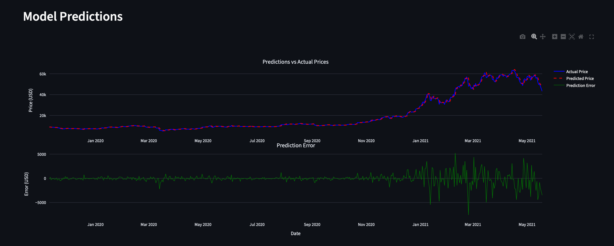

# ₿ BitPredictor

A machine learning-powered Bitcoin price prediction tool with an interactive web dashboard.

## 🚀 Quick Start

1. **Clone and Setup**
   ```bash
   git clone <your-repo-url>
   cd BitPredictor
   python3 -m venv venv
   source venv/bin/activate  # On Windows: venv\Scripts\activate
   pip install -r requirements.txt
   ```

2. **Run the Dashboard**
   ```bash
   streamlit run dashboard.py
   ```

3. **Train and Predict**
   - Adjust model parameters in the sidebar
   - Click "🚀 Train Model" to start training
   - View predictions and performance metrics

## 📊 Demo

### Dashboard Overview


### Model Training & Results


## 🛠️ Features

- **Interactive Dashboard**: Real-time Bitcoin price visualization
- **Customizable Models**: Adjust window size, prediction horizon, and training epochs
- **Performance Metrics**: MAE, RMSE, MAPE evaluation
- **Visual Analysis**: Compare predictions vs actual prices
- **Historical Data**: Automatic Bitcoin price data download

## 📈 Model Architecture

- **Input**: Historical price windows (customizable size)
- **Architecture**: Dense neural network with ReLU activation
- **Output**: Multi-day price predictions
- **Framework**: TensorFlow/Keras

## 🔧 Alternative Usage

Run the standalone model script:
```bash
python model.py
```

## 📋 Requirements

- Python 3.8+
- TensorFlow
- Streamlit
- Pandas, NumPy, Matplotlib, Plotly

